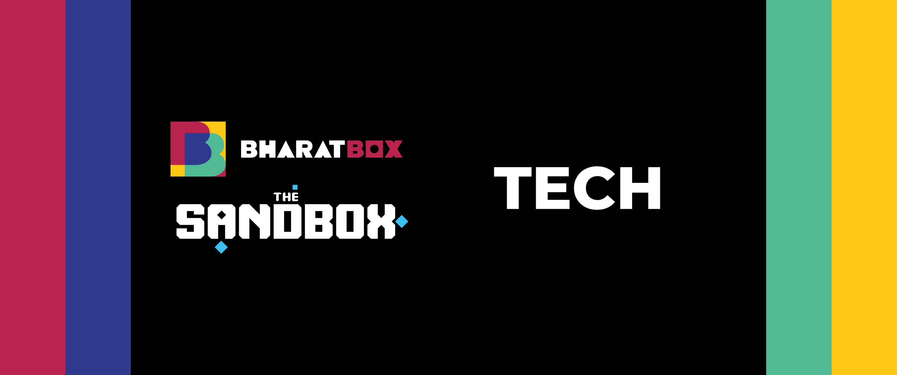
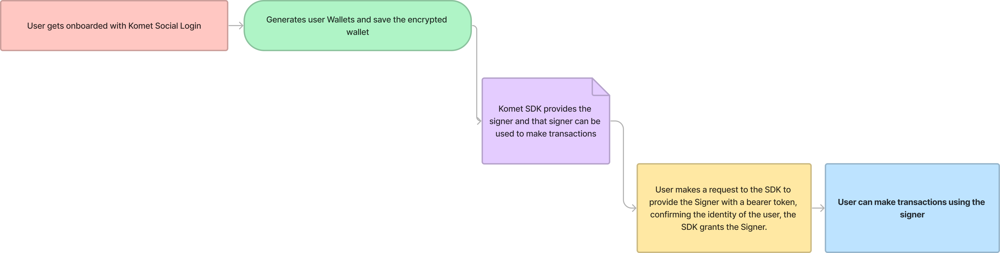
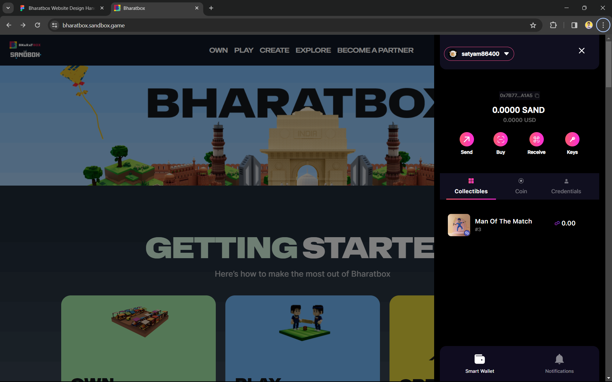
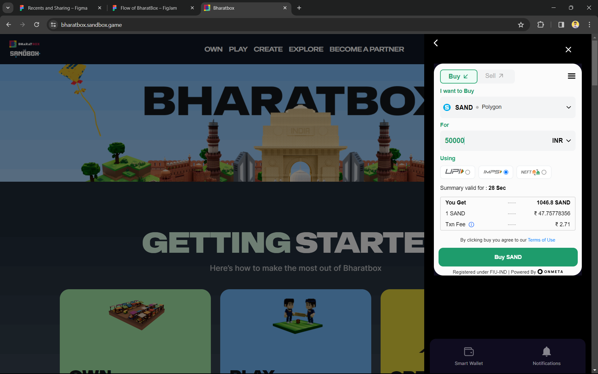
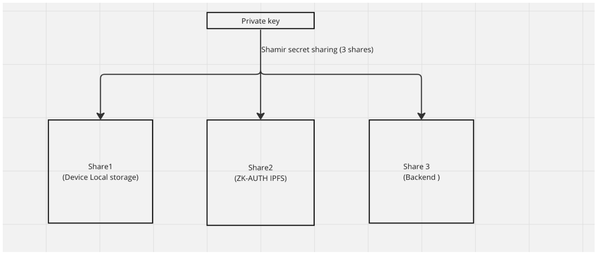

# BharatBox Technical Documentation

### Table of Contents:
Introduction

System Architecture

Website Overview

Wallet Integration

User Flow Diagrams

API documentation

Security Measures 

Third-Party Integrations

Development and Deployment 


## Introduction

#### Company Overview
Experience the vibrant culture of India in BharatBox, the metaverse destination for entertainment and community. Explore virtual worlds by top Bollywood and Indian sports stars, own exclusive NFTs, and connect with like-minded individuals.

Join us now and be a part of the ultimate Indian metaverse experience within The Sandbox metaverse. BharatBox offers a platform for users to showcase their talents and creativity.

Let your imagination run wild in the Indian metaverse!

##### Hungama World
Hungama Music is a digital music streaming service and music library based in India. It offers a wide range of Indian and international songs across different languages and genres, including Bollywood, regional, and devotional music.

##### T Series
T-Series is a music label and film production company based in India. T-Series primarily produces and distributes Bollywood music and Indian pop music, and also produces and distributes Indian films. T-Series has become one of the most popular music labels in India, with a large following on YouTube.

And other IPs are coming soon on BharatBox such as - **Shemaroo**, **Mythoverse**, **IIFA**, **Eros Now**, etc.

#### Purpose of Document
The primary purpose of the technical documentation for BharatBox's website development is to establish a comprehensive knowledge base that encapsulates all technical and design aspects of the project. This documentation serves several key functions:

1. Knowledge Repository: It acts as a comprehensive repository of all technical and design aspects of the website, from the Landing Page to the Landsale Page, and additional features like Create, Play, etc.

2. Collaboration and Communication: Facilitates clear communication and coordination between various teams, including third-party agencies like Komet - Komet - ZERO Gas to access, mint, and own NFTs.  and Spacekayak - Spacekayak | Creative Studio for Startups.

3. Development Guide: Provides detailed technical and design guidance, ensuring consistency and alignment with project goals.

4. Quality Assurance: Serves as a reference for testing, helping maintain quality and troubleshoot issues effectively.

5. Training and Onboarding: Aids in training new team members and onboarding stakeholders, offering a complete understanding of the project.

6. Future Development and Scalability: Guides future enhancements and updates, ensuring scalability and continuity of the platform.

#### Target Audience
This document is for BharatBox internal team to overview and get the knowledge of what all technical and design things are present in the website. And the Development team who needs to update what’s going on in tech so that future scalability is maintained. And the Design team who can cross check the elements the design essence the components and all that are already created - to maintain and create more in future. The global team of Sandbox they can also have access to this document to see what all things are going on and already developed in BharatBox.


## System Architecture

#### High Level Architecture

High level working of Komet Wallet on BharatBox Website



The BharatBox system architecture is designed to support a robust and scalable metaverse platform, focusing on user engagement, security, and seamless integration of various technologies. Below is a high-level overview of the architecture components:

Frontend Architecture:
1. **Technologies Used**:

    - React.js and Next.js: These JavaScript libraries are employed for building a user-friendly and interactive frontend.
    - Tailwind CSS: For styling, ensuring a responsive and modern design.
2. **Responsiveness and Compatibility**:

    - Designed to be fully responsive across different devices and browsers.
    - Dynamic loading and rendering techniques are used to optimize performance.

Backend Architecture:
1. **Server-Side Rendering**:
    - Next.js is used for server-side rendering, improving load times and SEO performance.

2. **API Layer**:

    - A robust API layer handles requests between the frontend and the blockchain network.
    - APIs include Alchemy for blockchain interactions and Komet SDK for wallet management.

3. **Authentication and Security**:

    - Google Authentication and Bearer Token mechanisms are used for secure user authentication.
    - API Gateway serves as the entry point for backend requests, adding an additional layer of security.

Blockchain Integration:
1. **Smart Contracts**:

    - Ethereum-based smart contracts are used for handling NFT transactions and land sales.
    - Smart contracts are audited and optimized for gas efficiency.
    
2. **Wallet Integration**:

    - Komet Wallet integration allows for secure and seamless transactions within the platform.
    - Wallet transactions are supported by WalletConnect and Ether.js for blockchain interactions.

Storage and Data Management:
1. **IPFS for Decentralized Storage**:

    - Utilizes InterPlanetary File System (IPFS) for storing NFT data, ensuring decentralization and redundancy.
    - IPFS (InterPlanetary File System) is utilized for decentralized data storage

2. **Secure Key Management**:

    - Private keys are encrypted using the Shamir Secret Sharing algorithm, enhancing security.
    - Storage solutions are implemented for key management, including local device storage for the mobile wallet.

## Website Overview


#### Landing Page [link](https://bharatbox.sandbox.game/)

This is the main footfall page for the user where they come to see about what BharatBox is and all the Indian confined elements making it look more authentic to what the name suggests BharatBox. It emphasises on what all you can do in BharatBox such as OWNING A LAND, PLAYING INDIAN EXPERIENCES, CREATING YOUR OWN EXPREINCES etc. Also it showcases your friendly neighbours which are our partners.

---


#### Landsale Page [link](https://bharatbox.sandbox.game/landsale)
This page is dedicated to the sale of virtual land within BharatBox Bharatverse. It includes detailed information about the wholce landsale procedure dates and all within once page. Our partners are also listed here some FAQs and that all.

---

The website provides a comprehensive overview of BharatBox's features and functionalities it also includes the wallet in the left top corner which you can open and use functionality wise.



_The other pages such as Play, Create, Explore are still under development
and will be added in future updates._</s>


## Wallet Integration

#### Wallet Creation and Management:
- **Komet Wallet Integration**: BharatBox has incorporated the Komet Wallet into its ecosystem to provide users with the ability to securely create and manage digital wallets.
- **NFT and Asset Storage**: These digital wallets enable the storage of NFTs and other digital assets, including virtual land, which users can buy, sell, or trade within the platform.
- **In-platform Purchases**: The wallet also facilitates in-platform transactions, allowing users to purchase items or services offered within BharatBox.

#### Transaction Process:
- **Support for Various Transactions**: The Komet Wallet is designed to handle a range of transaction types, including the acquisition and disposal of NFTs, trading of virtual land, and asset transfers between users.
- **Advanced Encryption**: All transactions are safeguarded using state-of-the-art encryption methods, ensuring the security and integrity of user assets.
- **Sand Token Purchase**: The wallet allows purchase of Sand Token on Polygon Chain. Using the Onmeta Purchase service.


#### User Authentication and Security:
- **Komet Social Login**: For user authentication, BharatBox utilizes Komet Social Login, which streamlines the sign-in process and integrates with the wallet system.
- **Encryption and Token-Based Security**: Wallets are encrypted, and additional security is provided through Google Authentication and Bearer Token login mechanisms, which add layers of security to user sessions and transactions.
- **Shamir Secret Sharing Algorithm**: A critical aspect of the security infrastructure is the use of the Shamir Secret Sharing algorithm to secure private keys. This cryptographic method splits the private key into multiple shares, requiring a subset to reconstruct the original key, thereby enhancing security.

### Wallet Architecture:



#### Private Key Encryption and Distribution:
- **Shamir Secret Sharing**: The private key of a user's wallet is encrypted using the Shamir Secret Sharing algorithm. This method splits the private key into three separate shares.
- **Secure Storage Locations**: Each share of the encrypted private key is stored in a different, user-controlled location:
    - **Share 1**: Stored in device local storage, which provides convenient and quick access for the user.
    - **Share 2**: Kept in ZK-AUTH IPFS (Zero-Knowledge Authenticated InterPlanetary File System), a decentralized and secure storage solution that uses zero-knowledge proofs to ensure privacy and security.
    - **Share 3**: Located in the backend, likely in a secured database managed by BharatBox's infrastructure.

By distributing the key shares across different storage mediums, BharatBox ensures that the user's wallet can only be accessed when the requisite number of key shares are combined, thereby protecting against unauthorized access and enhancing overall wallet security.

### Additional Security Considerations:

#### Backend Security:
- **Authentication Service**: The backend is fortified by an Authentication Service that secures user registration and login. It manages sessions, devices, and login methods, ensuring that user credentials are securely handled.
- **API Gateway**: The API Gateway acts as the central point for backend requests. It filters requests through a series of security measures designed to block any malicious or unidentifiable sources from accessing the backend system.

The provided link to the Komet SDK beta documentation likely contains additional technical details on the implementation and usage of the SDK, which underpins the wallet functionality within BharatBox. This SDK would typically provide developers with the tools necessary to integrate Komet Wallet features, such as user authentication, wallet creation, transaction signing, and more, into the BharatBox platform.

The combination of secure wallet management, encrypted transactions, and robust authentication and security measures demonstrates BharatBox's commitment to providing a safe and user-friendly environment for its metaverse participants.


## User Flow Diagram


 This type of diagram is used to map out the steps a user takes to navigate through a website or application. Here's a breakdown of the flow:

1. **User Arrival**: The starting point is when a user comes to the website "bharatbox.sandbox.game."

2. **Sign In**:
    - The sign-in process is maintained through Komet's social login, which integrates with the BharatBox wallet.
    - If a user does not sign in, they are not able to interact with the website ("Not able to do anything on website").
    - After signing in, users are able to access the whole landing page and other sub-tabs, meaning the full functionality of the website is unlocked.

3. **Whole Website**: Once signed in, the user can navigate to various parts of the site, which include:
    - **Landsale Page → OWN**: Where users can own virtual land.
    - **Play → Sandbox Experiences**: Users can play games and have various experiences within the Sandbox.
    - **Create → Create games, VoxEdit, Gamemaker**: This allows users to create their own games and content using tools like VoxEdit and Gamemaker.
    - **Community**: A section dedicated to community engagement and interaction.
    - **Events → Luma Integration**: This involves integration with Luma for event management and participation.
    - **Education → Sandbox GitBook**: An educational resource area, possibly leveraging GitBook for content delivery.
    - **Become a Partner → Form**: A section where users can sign up to become partners with the platform, likely involving a form submission.

4. **Sign Up/Sign In Note**: The Sign and Sign Up process is simple with only Google and Mobile OTP signup for easier and smoother experience for the web2 users.
 ---

 ## API Documentation

This API documentation is intended for developers integrating BharatBox functionalities into their applications. It covers the Alchemy APIs, Komet SDK, and Hashcase API.

## Alchemy API

### Overview
Alchemy provides a suite of blockchain APIs. For BharatBox, the relevant endpoints are `getNFTsForOwner` and `alchemy_getTokenBalances`, which allow retrieval of NFT ownership information and token balances.

### getNFTsForOwner
Fetches all NFTs owned by a specific address.

**Endpoint:**
`GET /v3/{ownerAddress}/getNFTs/`

**Parameters:**
- `ownerAddress`: The wallet address of the NFT owner.

**Response:**
```json
{
  "ownedNfts": [
    {
      "contract": {
        "address": "string",
        "tokenType": "string"
      },
      "id": {
        "tokenId": "string",
        "tokenMetadata": {
          "tokenType": "string"
        }
      },
      "balance": "string",
      "title": "string",
      "description": "string",
      "tokenUri": {
        "gateway": "string",
        "raw": "string"
      },
      "media": [
        {
          "gateway": "string",
          "raw": "string"
        }
      ],
      "metadata": {},
      "timeLastUpdated": "string"
    }
  ],
  "totalCount": 0
}
```

### alchemy_getTokenBalances
Provides token balances for a given address.

**Endpoint:**
`GET /v2/{address}/alchemy_getTokenBalances/`

**Parameters:**
- `address`: The wallet address for which token balances are requested.

**Response:**
```json
{
  "address": "string",
  "tokenBalances": [
    {
      "contractAddress": "string",
      "tokenBalance": "string",
      "tokenType": "string"
    }
  ],
  "blockNumber": "string"
}
```

## Komet SDK

### Overview
The Komet SDK is designed to facilitate wallet and user account management within the BharatBox platform.

**Initialization:**
```javascript
import { Komet } from 'komet-sdk';

const komet = new Komet({
  apiKey: 'your-api-key-here',
  environment: 'production'
});
```

### User Authentication
**Method:**
`komet.authenticateUser(credentials)`

**Parameters:**
- `credentials`: An object containing user authentication details.

**Response:**
```json
{
  "accessToken": "string",
  "user": {
    "id": "string",
    "walletAddress": "string",
    "email": "string"
  }
}
```

## Hashcase API

### Overview
The Hashcase API handles NFT minting and transfers to user wallets on BharatBox.

### transferNftToWallet
Transfers a specified NFT to a user's wallet.

**Endpoint:**
`POST /localnft/transferNftToWallet`

**Headers:**
- `x-api-key`: Your API key.

**Body:**
```json
{
  "user_id": 1516,
  "nft_id": 608,
  "wallet_address": "0x93D2c05D04303302312E887312478a800FbcF838",
  "owner_address": "0xDb8F34eb2304d18A60c53D19cD18D6274935daEE"
}
```

**Response:**
```json
{
  "transactionHash": "string",
  "status": "string",
  "message": "string"
}
```

## Security Measures 

BharatBox is dedicated to providing a secure environment for its users by implementing rigorous security protocols across the platform. This commitment to security is evident in every layer of BharatBox's technology stack and operational procedures.

#### Data Encryption

Sensitive data, whether at rest or in transit, is protected using state-of-the-art encryption algorithms. BharatBox ensures that:

- All user data is encrypted using robust encryption standards before being stored.
- SSL/TLS encryption is used for data being transmitted over the network to prevent interception or eavesdropping.
- Database encryption is employed for all user and transactional data to safeguard against unauthorized database access.

#### Secure Authentication

BharatBox leverages multiple authentication mechanisms to ensure that user accounts are protected against unauthorized access:

- **Google Authentication**: Provides a secure and user-friendly way to manage account access, leveraging OAuth 2.0 protocol for secure authorization.
- **Bearer Tokens**: Used in conjunction with HTTP requests to ensure that the client requesting access to resources is authenticated.
- Each session is carefully managed with session tokens that are generated securely and invalidated upon logout or after a period of inactivity.

#### API Security

APIs are the backbone of interaction between the front end, the backend, and blockchain services. BharatBox has implemented the following measures:

- **API Gateway**: Acts as a protective layer, managing and authorizing API requests. It ensures that only valid and authenticated requests reach the backend services.
- **Rate Limiting**: Protects against denial-of-service attacks and ensures the stability of the service by limiting the number of requests a user can make within a certain timeframe.
- **Input Validation**: Ensures that only properly formatted data is processed by the APIs to prevent common web vulnerabilities such as SQL injection.

#### Shamir Secret Sharing for Private Key Management

Private keys are critical for the security of blockchain transactions. BharatBox employs Shamir's Secret Sharing algorithm to enhance the security of these keys:

- **Key Splitting**: Private keys are split into multiple shares, and a subset of these shares is required to reconstruct the original key.
- **Distributed Storage**: Shares are distributed across multiple storage locations under the user's control, such as device local storage, ZK-AUTH IPFS, and the backend. This not only secures the key against theft but also against the loss of a single storage location.

#### Wallet Architecture

The wallet architecture within BharatBox has been carefully designed with security as a priority:

- **Komet Wallet**: Created and managed via the Komet SDK, which integrates with Ether.js and Alchemy for blockchain transactions.
- **WalletConnect**: Used for secure wallet connectivity, enabling transactions and wallet management across different devices and platforms.

#### Security in Backend Deployment

- **Auth Service**: Ensures secure registration and login, managing user sessions and authentication methods.
- **API Gateway**: Filters all backend requests to eliminate potential threats from unrecognized sources.

By adhering to these rigorous security measures and protocols, BharatBox ensures that its platform remains secure, resilient, and trustworthy for its users, developers, and partners.


## Third Party Integrations

This documentation details the APIs available for third-party developers to integrate BharatBox functionalities into external applications. It includes endpoints from Alchemy for blockchain interactions, the Komet SDK for wallet management, and the Hashcase API for NFT minting and transfers.

### Alchemy Blockchain API

#### Overview
Alchemy's blockchain API endpoints are crucial for third-party services to interact with BharatBox's blockchain-layer functionalities. The `getNFTsForOwner` and `alchemy_getTokenBalances` endpoints are particularly relevant.

#### Retrieve NFT Ownership
Obtains all NFTs associated with a given wallet address on the blockchain.

**Endpoint:**
`GET /v3/getNFTs/{ownerAddress}`

**Usage:**
Fetches NFT details owned by a specific address, including contract details and metadata.

**Parameters:**
- `ownerAddress` - The Ethereum wallet address.

**Sample Response:**
```json
{
  "ownedNfts": [...],
  "totalCount": "integer"
}
```

#### Query Token Balances
Provides balance information for ERC-20 tokens.

**Endpoint:**
`GET /v2/getTokenBalances/{address}`

**Usage:**
Returns the token balances for the specified address, essential for wallet balance display and transaction validation.

**Parameters:**
- `address` - The Ethereum wallet address.

**Sample Response:**
```json
{
  "tokenBalances": [...],
  "blockNumber": "integer"
}
```

### Komet SDK

#### Overview
The Komet SDK provides a comprehensive toolkit for managing BharatBox wallet functionalities within third-party applications.

#### Initialization
Sets up the SDK for use in your application.

**Sample Initialization:**
```javascript
import { Komet } from 'komet-sdk';

const komet = new Komet({
  apiKey: "<API_KEY>",
  environment: "production"
});
```

### Authenticate Users
Manages user authentication and session creation.

**Method:**
`komet.authenticateUser(credentials)`

**Usage:**
Authenticates users and creates secure sessions for wallet interactions.

**Parameters:**
- `credentials` - The user's login credentials.

**Sample Response:**
```json
{
  "accessToken": "string",
  "user": {...}
}
```

### Hashcase NFT API

#### Overview
The Hashcase API facilitates NFT minting and transfers, allowing for seamless NFT integration into third-party applications.

#### Transfer NFT
Enables the transfer of NFTs to user wallets upon acquisition.

**Endpoint:**
`POST /localnft/transferNftToWallet`

**Usage:**
Mints and transfers an NFT to the provided wallet address, useful for reward distribution or NFT sales.

**Headers:**
- `x-api-key` - The API key for authentication.

**Request Body:**
```json
{
  "user_id": "integer",
  "nft_id": "integer",
  "wallet_address": "string",
  "owner_address": "string"
}
```

**Sample Response:**
```json
{
  "transactionHash": "string",
  "status": "string",
  "message": "string"
}
```

Third-party developers can utilize these APIs to integrate BharatBox's digital asset and wallet management capabilities into their applications, providing a seamless user experience for accessing NFTs and managing token balances. The above documentation outlines the key integration points, expected request and response formats, and general usage guidelines.


## Development and Deployment

### Development Standards and Practices

BharatBox's development cycle adheres to industry best practices to ensure a high-quality, maintainable, and scalable platform. Below are the standards and practices that the BharatBox team follows:

#### Code Quality and Standards
- **Consistent Coding Conventions**: Our team follows a consistent set of coding conventions to ensure readability and maintainability of the codebase.
- **Code Reviews**: Every piece of code is thoroughly reviewed by peers to catch potential bugs, ensure adherence to coding standards, and maintain code quality.

#### Tech Stack
- **Frontend Development**: Utilizing React.js and Next.js, we have built a reactive and performant frontend. React.js enables us to create dynamic user interfaces with component-based architecture, while Next.js offers server-side rendering for improved SEO and faster page loads.
- **Styling**: Tailwind CSS is used for its utility-first approach, which allows for rapid UI development and ensures a consistent design language across the platform.
- **Mobile Wallet**: Developed using React Native, providing a seamless and native experience for mobile users. This choice also allows for code sharing between iOS and Android platforms, reducing development time.

### Deployment Strategy

BharatBox's deployment strategy is designed to minimize downtime and provide a robust service to its users:

#### Continuous Integration and Continuous Deployment (CI/CD)
- **Automated Builds**: Every code commit triggers an automated build process, running tests and ensuring that the new changes do not break the build.
- **Automated Deployment**: Upon successful build and test execution, the code is automatically deployed to the production environment.

#### Hosting and Scalability
- **Vercel**: The frontend is hosted on Vercel, which is known for its serverless functions, edge network, and automatic scaling capabilities.
- **Load Balancing**: We implement load balancing to distribute traffic across multiple servers, ensuring high availability and reliability.

#### Version Control
- **GitHub**: We utilize GitHub for version control, leveraging features such as pull requests, branches, and GitHub Actions for CI/CD pipelines.

#### Security and Configuration Management
- **Environment Configuration**: Sensitive configuration settings are stored in environment variables and are never hardcoded into the codebase.
- **Dependency Management**: Dependencies are regularly updated to their latest versions to include new features and security patches.

By adhering to these development and deployment standards, BharatBox ensures that the platform remains state-of-the-art, secure, and responsive to the needs of its users. It allows for rapid development cycles, efficient problem resolution, and a stable, scalable environment for the burgeoning metaverse community.

---
